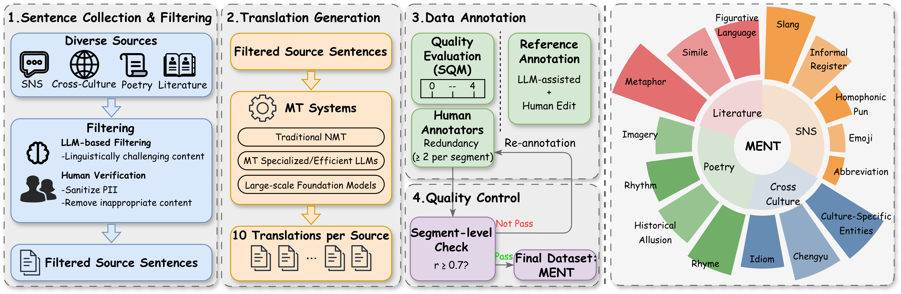
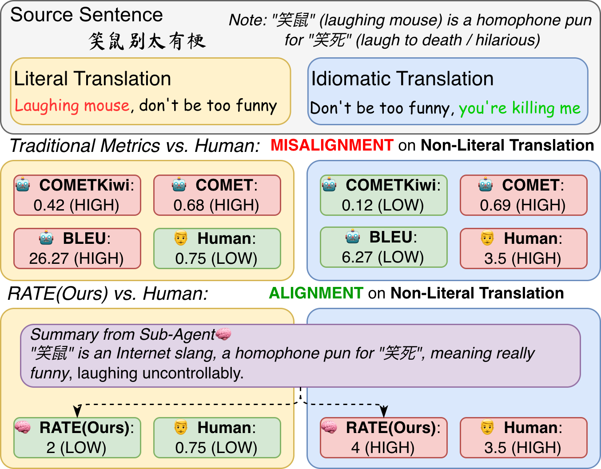
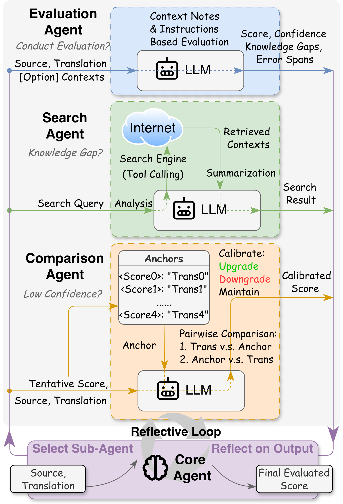

Official repository of **"Beyond Literal Mapping: Benchmarking and Improving Non-Literal Translation Evaluation"**
[](https://arxiv.org/abs/2601.07338)

## 🌟 The MENT Dataset
We introduce **MENT** (<u>M</u>eta-<u>E</u>valuation dataset of <u>N</u>on-Literal <u>T</u>ranslation), a human-annotated meta-evaluation dataset to systematically assess MT evaluation metrics. 

Download: You can download the dataset from [](https://huggingface.co/datasets/yztian/MENT).

<p align="center"> 

## 📊 Meta-Evaluation on Non-Literal Translation Content
Our comprehensive meta-evaluation reveals the unreliability of MT metrics on non-literal content. Traditional metrics are fundamentally limited by the lack of deep semantic understanding, while LLM-as-a-Judge paradigms are hindered by the static knowledge cutoff and inherent score inconsistency.

<p align="center"> 

The scripts of meta-evaluation are based on [MT-Metrics-Eval (MTME)](https://github.com/google-research/mt-metrics-eval). All scripts are located in `meta_eval/`.

## 🚀 The RATE Evaluation Framework
We explore the agentic MT evaluation framework **RATE** (<u>R</u>eflective <u>A</u>gentic <u>T</u>ranslation <u>E</u>valuation), architected around a centralized Core Agent, and orchestrates three functional sub-agents: the Evaluation Agent for pointwise assessment, the Search Agent for online knowledge retrieval, and the Comparison Agent for calibration by pairwise evaluation.

<p align="center"> 

The core implementation of the framework is located at `agentic/` directory.

## Citation
```bibtext
@misc{tian2026literalmappingbenchmarkingimproving,
      title={Beyond Literal Mapping: Benchmarking and Improving Non-Literal Translation Evaluation}, 
      author={Yanzhi Tian and Cunxiang Wang and Zeming Liu and Heyan Huang and Wenbo Yu and Dawei Song and Jie Tang and Yuhang Guo},
      year={2026},
      eprint={2601.07338},
      archivePrefix={arXiv},
      primaryClass={cs.CL},
      url={https://arxiv.org/abs/2601.07338}, 
}
```